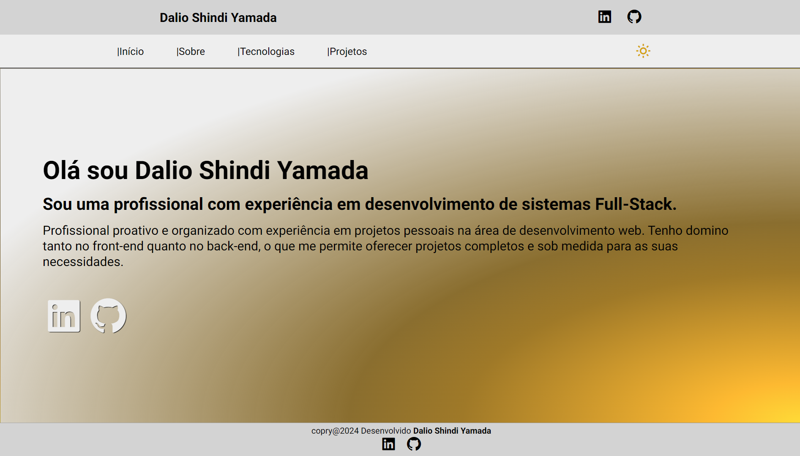

# My PORTFÓLIO

## Olá sejam bem-vindo

## Novo Portfólio no Ar!

Estou muito feliz em compartilhar meu novo portfólio com vocês!

Este projeto foi construído do zero com base no conhecimento que adquiri no curso do DevClub, utilizando HTML, CSS e Javascript. O objetivo principal era criar um site responsivo que apresentasse meus projetos e habilidades de forma clara e atraente.

### O que você encontrará no meu portfólio:

- Meus projetos mais recentes e relevantes
- Descrições de cada projeto
- Habilidades técnicas que domino
- Links para minhas redes sociais linkedin e github
- Visite meus projetos atravéz do botão Deploy

Agradeço ao DevClub por me proporcionar a oportunidade de aprimorar minhas habilidades e me tornar um desenvolvedor mais completo.

## Link:

> Portfólio: https://daliosy.github.io/my-PORTFOLIO

> Linkedin: https://www.linkedin.com/in/dalio-s-yamada/

> GitHub: https://github.com/DalioSY

#desenvolvedorweb #portfólio #devclub #html #css #javascript #responsivo

## Imagens:

 
  
  

